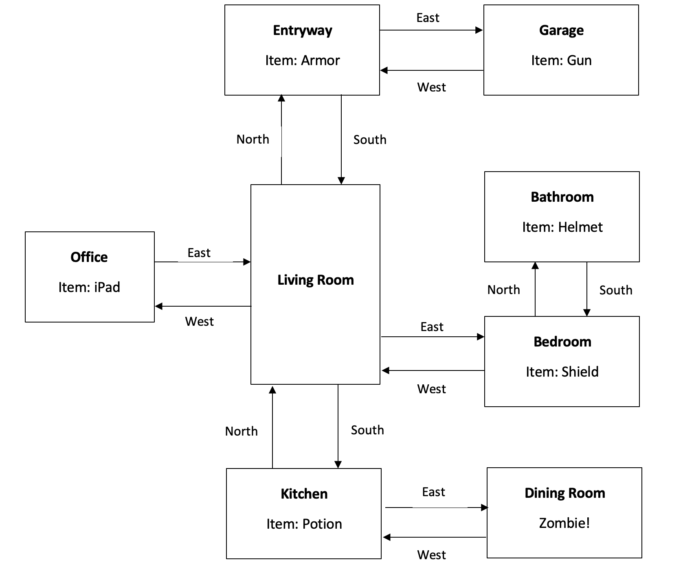

# Welcome to Melissa Smith's ePortfolio

### Welcome to my ePortfolio! As I stand on the cusp of graduating with a degree in Computer Science, this platform serves as a testament to my journey of exploration, growth, and passion for technology. As I embark on the exciting transition from student to a professional in the field, I invite you to explore my portfolio, where you'll discover my dedication to continuous learning, problem-solving skills, and enthusiasm for contributing to the dynamic landscape of computer science. Thank you for joining me on this journey, and I look forward to the opportunities and challenges that lie ahead.

## Professional Self-Assessment
### Throughout my academic journey in the Computer Science program at SNHU, I have not only gained a robust technical foundation but have also honed crucial professional skills that are integral to success in the dynamic field of computer science.
### One of the key strengths I've developed is effective collaboration within a team setting. Although we never met face-to-face, weekly discussions with classmates and professors cultivated my teamwork, communication, and project management skills, preparing me for real-world scenarios where collaborative efforts are essential.
### Clear and concise communication is a cornerstone of success in the computer science domain. Throughout the coursework, I've refined my ability to articulate complex technical concepts to diverse stakeholders. An illustration of this skill is evident in a database enhancement project where I integrated SQLite into a text-based adventure game. My documentation and communication regarding the integration process demonstrate my proficiency in translating technical details into understandable information for various audiences.
### As we delve into the technical artifacts in the ePortfolio, each piece contributes to a comprehensive representation of my computer science talents. This portfolio is a testament to my ability to navigate the intricate realms of computer science, providing tangible evidence of my growth, adaptability, and readiness to contribute meaningfully in a professional setting.
### There are five course outcomes for CS-499 that I met. Each category explains which course outcomes were met and how. The five course outcomes are:
1. **Employ strategies for building collaborative environments that enable diverse audiences to support organizational decision making in the field of computer science.**
2. **Design, develop, and deliver professional-quality oral, written, and visual communications that are coherent, technically sound, and appropriately adapted to specific audiences and contexts.**
3. **Design and evaluate computing solutions that solve a given problem using algorithmic principles and computer science practices and standards appropriate to its solution, while managing the trade-offs involved in design choices.**
4. **Demonstrate an ability to use well-founded and innovative techniques, skills, and tools in computing practices for the purpose of implementing computer solutions that deliver value and accomplish industry-specific goals.**
5. **Develop a security mindset that anticipates adversarial exploits in software architecture and designs to expose potential vulnerabilities, mitigate design flaws, and ensure privacy and enhanced security of data and resources.**

### The original artifact I have chosen to use for all three enhancements is a text-based adventure game implemented in the Python programming language. The project was initially created during one of my first Computer Science courses, IT-140. It was meant to demonstrate my understanding of the Python language and software development principles. Please visit [original code](https://github.com/Melissarosesmith/Melissarosesmith.github.io/blob/338dcd8ae9969d127707e91a975aa6c9e1f3550a/Original%20Code/TextBasedGame-Original.py) if you would like to see the code of the original artifact. The following is a map of the rooms for the text-based adventure game.



## Code Review
### The following code review explains the original artifacts existing functionality, code analysis, and walks through the planned enhancements relating to Software Design and Engineering, Algorithms and Data Structure, and Databases. Please click [here](https://youtu.be/JytkHKX6oUc) to be redirected to YouTube for my Code Review.


## Software Design and Engineering
### As stated in the introduction, the original artifact is a text-based adventure game implemented in the Python programming language. The project was initially created during one of my first Computer Science courses, IT-140. It was meant to demonstrate my understanding of the Python language and software development principles.
### I am including this artifact in my ePortfolio because it effectively showcases my skills in object-oriented programming, algorithm design, and user input handling. The project involved the creation of a complex game structure, requiring the implementation of data structures to manage the game state. The decision-making logic and user interaction components demonstrate my ability to design user-friendly interfaces and handle diverse user inputs. Additionally, the inclusion of advanced features, such as inventory management and room transitions, highlights my problem-solving skills in a challenging programming environment. Overall, this artifact serves as a comprehensive representation of my technical competencies in software development, particularly in C++.
### During the enhancement process, I focused on improving the code structure, adding comments for clarity, and addressing issues such as const-correctness. The initial version had some issues, like trying to modify const objects, which were resolved in the current version. This enhancement aligns with the course objectives related to code quality, maintainability, and adherence to best practices. The artifact designed and evaluated computing solutions to solve problems and managed the trade-offs involved in converting from the Python programming language to the C++ programming language.
### Throughout the process of creating and improving this artifact, I learned the importance of code maintainability and the significance of adhering to coding standards. Challenges included debugging complex logical errors and addressing const-correctness issues. I learned that converting one programming language to another is not as straightforward as it might seem. Python and C++ can be similar in ways, but there are also big differences in each language’s syntax. The experience reinforced the value of code documentation and the importance of iterative development for continuous improvement.
### **Course Outcome 2:**
### **The skills for this artifact design, develop, and deliver professional-quality oral, written, and visual communications that are coherent, technically sound, and appropriately adapted to specific audiences and contexts.** The enhancements include clear and informative comments that describe the purpose and functionality of different sections. This contributes to the code's readability and helps other developers understand the design choices and implementation details. The enhancements include user-friendly messages that explain the game's objectives, rules, and player interactions. This adaptation is crucial for players who may not be familiar with the underlying code but need clear instructions to play the game effectively. The comments and output messages are designed to communicate effectively with both developers (for understanding the code) and players (for understanding the game).
### **Course Outcome 3:**
### **The skills for this artifact design and evaluate computing solutions that solve a given problem using algorithmic principles and computer science practices and standards appropriate to its solution, while managing the trade-offs involved in design choices.** The enhancements design a text-based adventure game that involves moving through various rooms, collecting items, and interacting with a zombie. It employs algorithms to handle player movement, item retrieval, and game progression. The moveRooms function defines the algorithm for determining the next room based on the current room and the player's move. This is an essential part of the game's logic, demonstrating the application of algorithmic principles. Standard C++ constructs are used, such as vectors, maps, loops, conditional statements, and string manipulation, aligning with common practices in C++ programming. The enhancements efficiently manage the trade-offs involved in processing user input for item retrieval and movement. It uses conditional statements to validate inputs, handles different cases, and provides appropriate feedback to the player, demonstrating careful consideration of design choices.
### Please visit [Artifact One](https://github.com/Melissarosesmith/Melissarosesmith.github.io/blob/9170814cfd287ccad648ddadfe6817dda1dc8796/Enhanced%20Artifacts/CS499-SoftwareDesignEngineering-Enhanced-Artifact1-Melissa.Smith/main.cpp) if you would like to see the enhanced code for the Software Design and Engineering artifact.


## Algorithms and Data Structures
### As stated in the introduction, the original artifact is a text-based adventure game implemented in the Python programming language. The project was initially created during one of my first Computer Science courses, IT-140. It was meant to demonstrate my understanding of the Python language and software development principles.
### I selected this artifact because I saw the potential it had to be improved. The artifact showcases skills and abilities in algorithms and data structures. The representation of the game world as a dictionary with rooms as nodes and directions as edges demonstrates an understanding of graph-based structures. The move_rooms function efficiently checks for valid moves in the current room, showcasing knowledge of graph traversal. The use of the inventory list to keep track of collected items demonstrates proficiency in using data structures to manage and track in-game resources. Effective use of conditional statements in various parts of the code showcases logical and algorithmic thinking. The code abstracts the game's state and logic into functions, providing a clean separation between different aspects of the game, contributing to better maintainability and readability. Overall, the artifact combines these components to create an interactive text-based game that leverages algorithms and data structures to manage the game world, player inventory, and user interactions effectively.
### The enhancements for the text-based game artifact optimize the game loop to prevent unnecessary checks or redundant code execution. It does this by checking the room for a zombie only when necessary and optimizing command parsing. The choice of different data structures, like the inventory list and the dictionary, impacts the time complexity of various operations within the game. These include the item retrieval, inventory checks, and room traversal. Maintaining low time complexity ensures scalability. The algorithmic logic was improved by ensuring that command processing is clearer and more concise. The game’s state transitions are well defined and unambiguous. Adding the new functions and refactoring the existing functions created a more efficient and overall, better performing program.
### The enhanced code optimizes algorithmic logic and efficiency by reducing redundancy and improving code readability. Specifically, the ‘show_status’ function eliminates repetitive code blocks for each room by using a common structure for item handling. This reduces code duplication and makes the function more concise. The improved function introduces a separate function ‘get_item_input’ to handle the logic for getting an item. This promotes modularization and improves code readability. It also allows for easy modification or extension of item-related logic. The ‘get_item_input” function also showcases the time complexity of the algorithmic logic. It does this by validating the user input and only checking the first split elements, which is an O(1) time complexity operation.
```
if command == 'get' and len(args) == 1 and args[0] == item.lower():
   inventory.append(item)
   print(f'{item.title()} retrieved')
else:
   print('Invalid input')
```
### Overall, from modifying this artifact I have learned that there are many ways to implement logic into code. When I originally created the text-based game, my only worries were making sure the code worked, now I’ve been able to improve that code so it functions and looks much better. I learned that just because the code works, doesn’t mean it can’t be improved.
### **Course Outcome 4:**
### **The skills for this artifact demonstrate an ability to use well-founded and innovative techniques, skills, and tools in computing practices for the purpose of implementing computer solutions that deliver value and accomplish industry-specific goals.** The enhancements use well-founded techniques such as input validation, dictionary-based room/item management, and efficient checks for game progression. It employs common Python programming tools and techniques to implement the game logic effectively. The code provides value by implementing a functional text-based adventure game with clear instructions, item retrieval mechanics, and game progression logic. It aligns with the industry-specific goal of creating engaging and interactive software solutions. The code optimizes algorithmic logic and demonstrates efficiency in several aspects:
* It utilizes a dictionary structure for rooms, providing O(1) access for room and item data, optimizing room navigation and item retrieval logic.
* Input handling and validation, such as normalizing user input to lowercase and stripping whitespace, contribute to robust computing practices.
* The use of O(1) operations for key checks in dictionaries and length checks in the inventory contributes to the efficiency of the code.

### **Course Outcome 5:**
### **The skills for this artifact develops a security mindset that anticipates adversarial exploits in software architecture and designs to expose potential vulnerabilities, mitigate design flaws, and ensure privacy and enhanced security of data and resources.** The enhancements implement input validation to ensure that users can't exploit the game by providing invalid input. This aligns with the goal of ensuring the security of the game's logic and preventing unintended behaviors. It shows a general awareness of user input validation in the ‘get_item_input’ and ‘move_rooms’ functions, preventing potential exploits through validation checks. This aligns with the development of a security mindset.
### Please visit [Artifact Two](https://github.com/Melissarosesmith/Melissarosesmith.github.io/blob/b85a750e8c3b40afef748d61e4111574a87af836/Enhanced%20Artifacts/TextBasedGame-AlgorithmsDataStructures-Enhanced-Artifact2-MelissaSmithpy.py) if you would like to see the enhanced code for the Algorithms and Data Structure artifact.


## Databases
### As stated in the introduction, the original artifact is a text-based adventure game implemented in the Python programming language. The project was initially created during one of my first Computer Science courses, IT-140. It was meant to demonstrate my understanding of the Python language and software development principles. However, for this artifact, I chose to add a database to the already enhanced code from the Algorithms and Data Structure category above.
### I am including this artifact in my ePortfolio because the SQLite database integration demonstrates my ability to work with databases in a real-world scenario. Storing and retrieving game state and inventory information from a database showcases my understanding of data persistence. The artifact reflects an efficient design, using data structures like dictionaries for room and item management. It also utilizes SQLite queries effectively for initializing and updating the game state. It demonstrates strong input validation techniques, ensuring that user commands are processed securely. This aligns with the course objective of developing a security mindset to anticipate and mitigate potential vulnerabilities.
### Some of the skills this artifact showcases are database management, efficient algorithms, and error handling. Setting up and managing an SQLite database for the game state and inventory is a key component showcasing my skills in data handling and persistence. The use of efficient algorithms, such as O(1) time complexity for key operations, demonstrates my understanding of algorithmic efficiency in software development. The inclusion of error handling mechanisms, especially in the try-except block, showcases my consideration for robust code and handling potential issues gracefully. The code has been refactored for improved readability. Functions like show_status and move_rooms are modular and well-organized, making the code more maintainable. The input handling has been optimized for case sensitivity and whitespace issues, making the code more user-friendly and less prone to errors.
### During the creation and improvement of the artifact, I gained hands-on experience with database integration, efficient algorithm design, and error handling. Challenges I faced included ensuring proper database initialization, handling different user inputs, and designing efficient algorithms for room navigation and item retrieval. Also, making sure I incorporated the database correctly into the existing code was a challenge I faced, but overcame with time and research.
### **Course Outcome 1:**
### **The skills for this artifact employ strategies for building collaborative environments that enable diverse audiences to support organizational decision making in the field of computer science.** The enhancements employ a modular structure with functions for different aspects of the game, making it more readable and maintainable. This facilitates collaboration among developers, allowing them to work on different parts of the code independently. The code includes a show_instructions function that provides clear guidance on how to play the game, contributing to user-friendly design and enhancing collaboration by making it easier for different audiences to understand and contribute to the project.
### **Course Outcome 5:**
### **The skills for this artifact develops a security mindset that anticipates adversarial exploits in software architecture and designs to expose potential vulnerabilities, mitigate design flaws, and ensure privacy and enhanced security of data and resources.** The enhancements uses SQLite for database operations, which is a good practice for security as it helps prevent SQL injection attacks by using parameterized queries (cursor.execute('...', (parameters,))). The code stores sensitive game state information (current room) in a separate table (game_state) and (player inventory) in another table (inventory). This separation of concerns contributes to better security practices. The database connections are opened securely, and the code handles potential errors gracefully. The code separates game state and player inventory into distinct tables, promoting good database design practices. By using parameterized queries, the code helps prevent SQL injection attacks, enhancing security.
### Please visit [Artifact Three](https://github.com/Melissarosesmith/Melissarosesmith.github.io/blob/1fd94d310f7de653a733e066467266e45b3a7d47/Enhanced%20Artifacts/TextBasedGame-Database-Enhanced-Artifact3-MelissaSmith.py) if you would like to see the enhanced code for the Database artifact.


